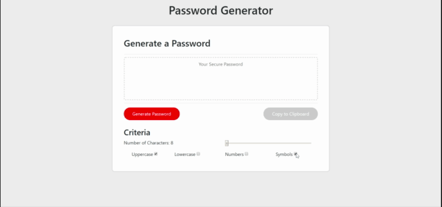
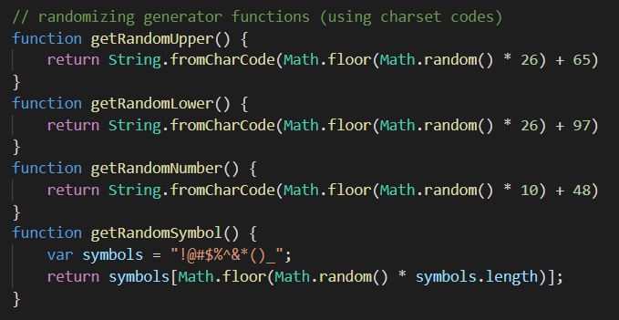

# Random Password Generator
A random password generator that takes user inputs to create passwords of varying complexity, utilizing bootstrap to make responsive at different viewports (640px, 768px, 980px) and Javascript to power functionality.

## Screen Grab (768px)

GIF of application in action. Displaying various options and functionality.

## Built With

* [HTML](https://developer.mozilla.org/en-US/docs/Web/HTML)
* [CSS](https://developer.mozilla.org/en-US/docs/Web/CSS)
* [Bootstrap](https://getbootstrap.com)
* [JavaScript](https://javascript.com)

Code snippet of randomizing the different character sets using the browser charset codes

## Deployed Link

* [Github Repository Page](https://github.com/rev1311/password-generator)

## Authors

* **Michael Partin** 

- [Link to Portfolio Site](https://rev1311.github.io/updated-portfolio/)
- [Link to Github](https://github.com/rev1311)
- [Link to LinkedIn](https://linkedin.com/in/michael-partin)

See also the list of [contributors](https://github.com/your/project/contributors) who participated in this project. HINT: Just me.

## Acknowledgments

* 

